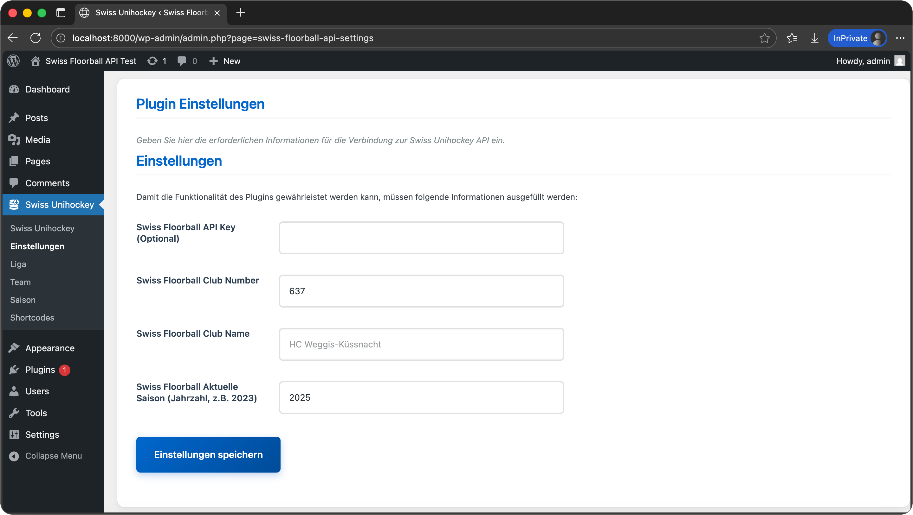
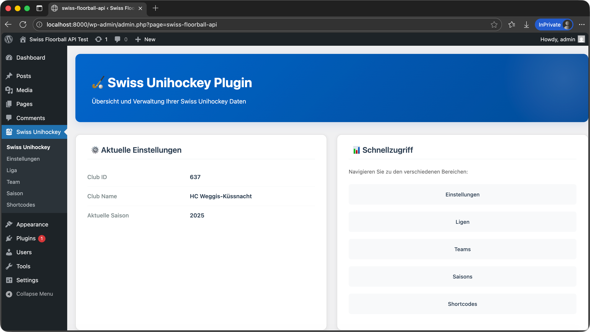
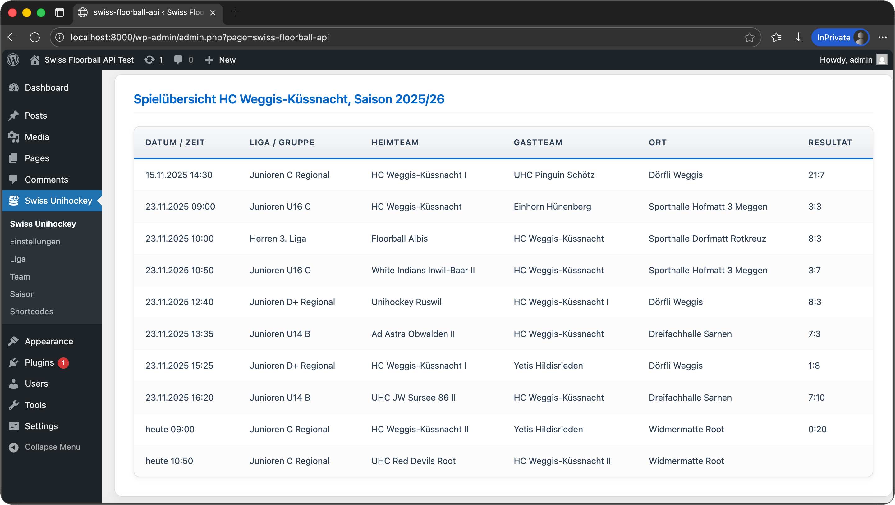
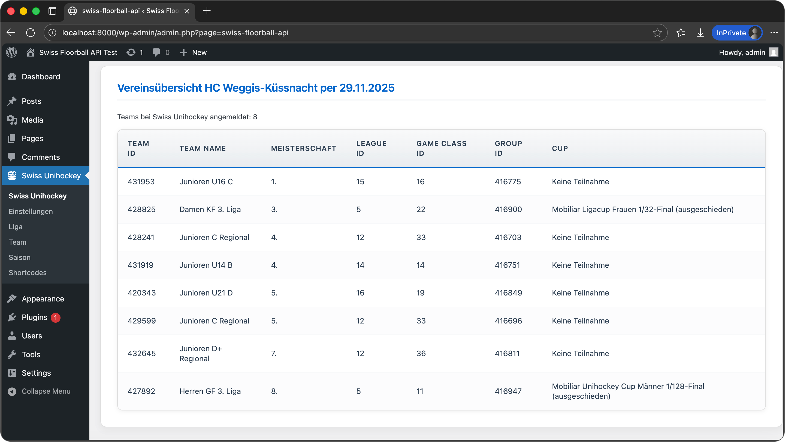
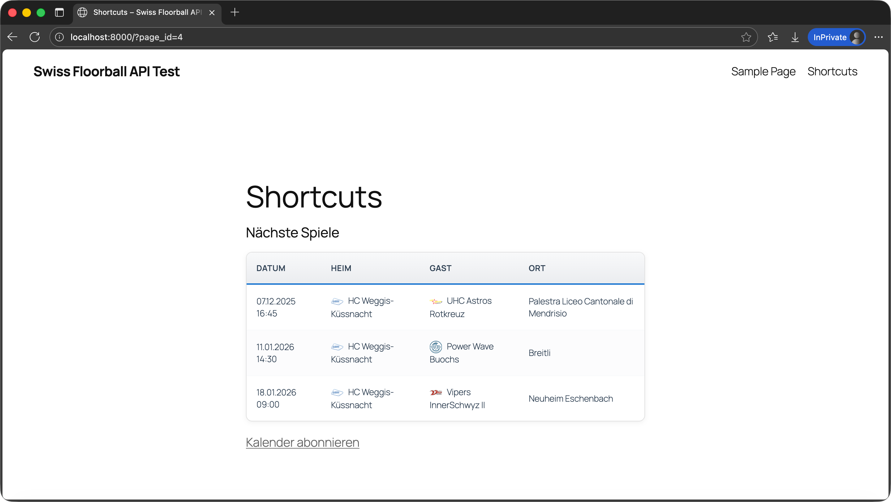
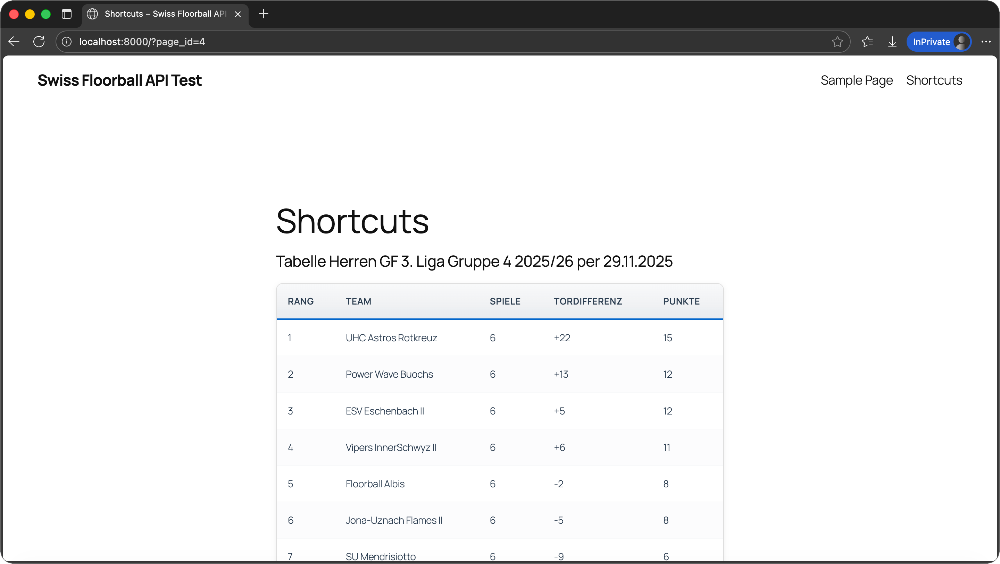

# Swiss Floorball API for WordPress


**Contributors:** flaviowaser  
**Donate link:** <https://www.paypal.me/flaviowaser>  
**Tags:** floorball, api, swiss floorball, unihockey, sports  
**Requires at least:** 5.0
**Tested up to:** 6.4  
**Stable tag:** 1.0.0  
**License:** GPLv2 or later  

The **Swiss Floorball API** plugin brings the power of the Swiss Unihockey API v2 to your WordPress site. Display games, rankings, team rosters, and player statistics with ease using simple shortcodes.

## 🚀 Features

* **🔌 Plug & Play:** Configure your Club ID once and get instant access to your club's data.
* **📅 Calendars:** Display upcoming games for teams or entire clubs. Includes **ICS subscription links** for users to add games to their personal calendars.
* **🏆 Rankings:** Always up-to-date league tables for any group or league.

* **📊 Statistics:** Show topscorer lists and detailed game events.
* **📱 Responsive:** Built-in responsive tables that look great on mobile devices.
* **👤 Player Profiles:** Showcase individual player stats and national team members.

## 🛠 Installation

1. Download the plugin and upload the `swiss-floorball-api` folder to your `/wp-content/plugins/` directory.
2. Activate the plugin through the **Plugins** menu in WordPress.
3. Navigate to **Settings > Swiss Floorball API**.
4. Enter your **Club ID** (e.g., `427892`) and the **Current Season** (e.g., `2025`).
5. Click **Save Changes**.


*Configure your Club ID and Season in the settings.*

## 📝 Shortcodes

Use these shortcodes in any Page or Post to display data.

### Club & Team Data

| Shortcode | Description | Attributes |
|-----------|-------------|------------|
| `[suh-club-teams]` | List all teams in your club. | None |
| `[suh-club-games]` | List all games for your club this season. | None |
| `[suh-team-games]` | List games for a specific team. | `team_id` |
| `[suh-calendars]` | Show upcoming games + ICS link. | `team_id`, `club_id` |

**Example:**

```
[suh-calendars team_id="427892"]
```

### League & Rankings

| Shortcode | Description | Attributes |
|-----------|-------------|------------|
| `[suh-rankings]` | Show the ranking table. | `season`, `league`, `game_class`, `group` |
| `[suh-topscorers]` | Show the topscorer list. | `season`, `league`, `game_class`, `group` |
| `[suh-groups]` | List available groups. | `season`, `league`, `game_class` |

**Example:**

```
[suh-rankings league="1" game_class="11" group="416947"]
```

### Players & Games

| Shortcode | Description | Attributes |
|-----------|-------------|------------|
| `[suh-player]` | Show player profile. | `player_id` |
| `[suh-game-events]` | Show events (goals, penalties) of a game. | `game_id` |
| `[suh-national-players]` | List national team players. | None |

## 🎨 Customization

The plugin uses standard CSS classes prefixed with `.sfa-`. You can easily override these in your theme's `style.css` or the Customizer to match your site's branding.

## ❓ FAQ

**Q: Where do I find the IDs?**  
A: You can find Team, Club, and League IDs in the URL on the [Swiss Unihockey website](https://www.swissunihockey.ch) or by using the plugin backend to explore and copy the IDs.

**Q: Is this plugin free?**  
A: Yep! It’s open-source and completely free to use.

**Q: Is this an official Swiss Floorball plugin?**  
A: Nope. This plugin isn’t official and has no connection to Swiss Floorball.

**Q: Can I use this plugin for commercial purposes?**  
A: Sorry, no. It’s meant only for personal and non-commercial use. It’s designed for Swiss Floorball clubs and teams to show their data on their websites.

**Q: Any further questions?**  
A: Just drop me a message on [GitHub](https://github.com/flawas), [LinkedIn](https://www.linkedin.com/in/flawas/), or via my [homepage](https://flaviowaser.ch/contact/).

## 📸 Screenshots

1. **Settings Page**: Easy configuration.

2. **Club Games**: Overview of all club matches.

3. **Teams**: Detailed teams tables.

4. **Calendar**: Upcoming games with calendar export.

5. **Rankings**: Detailed rankings tables.


---

*Developed by [Flavio Waser](https://flaviowaser.ch)*
